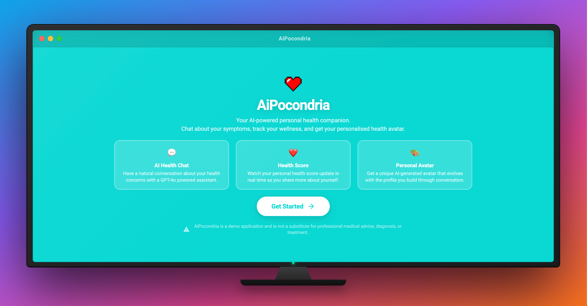

# AiPocondriaco

An AI-powered web app that playfully embraces hypochondria — users chat with an AI doctor, get a dramatised health score, and receive an AI-generated portrait of their imaginary ailments.

**Live demo:** https://aipocondriaco.onrender.com



---

## What it does

1. **Intro & login** — users land on an animated intro page and log in (or use the demo account).
2. **AI chat** — a streaming conversation with a Gemini-backed "doctor" that collects symptoms and personal details.
3. **Health score** — after the chat the AI produces an over-the-top health assessment.
4. **AI portrait** — Gemini generates a custom image illustrating the user's fictional condition.
5. **Demo mode** — when no `GEMINI_API_KEY` is set the app runs with scripted responses and a placeholder image, so the full flow can be experienced without an API key.

---

## Tech stack

| Layer | Technology |
|-------|-----------|
| Frontend | Angular 17+ (standalone components, SSR-ready) |
| Backend | Node.js / Express |
| AI | Google Gemini (text + image generation via `@google/generative-ai`) |
| Database | PostgreSQL (`pg`) |
| Hosting | Render |

---

## Project structure

```
AiPocondriaco/
├── frontend/          # Angular app
│   └── src/app/
│       ├── pages/     # intro, login, homepage, error-page
│       ├── services/  # data service, auth
│       ├── guards/    # auth guard
│       └── ...
└── server/            # Express API
    ├── routes/        # prompts, auth, utenti, patologie, attivitaFisiche
    ├── mock/          # demo scripted responses
    ├── database/      # PostgreSQL helpers
    ├── constants.js
    ├── utils.js
    └── server.js
```

---

## Running locally

### Prerequisites

- Node.js 18+
- PostgreSQL instance
- Google Gemini API key (optional — omit for demo mode)

### Backend

```bash
cd server
cp .env.example .env   # fill in DB_URL and optionally GEMINI_API_KEY
npm install
npm run devStart
```

### Frontend

```bash
cd frontend
npm install
ng serve
```

The Angular dev server proxies API calls to `localhost:3000`. For a production-like setup, build the frontend (`ng build`) and let the Express server serve the `dist/` folder — that is how the Render deployment works.

---

## Environment variables

| Variable | Required | Description |
|----------|----------|-------------|
| `PORT` | No | Server port (default `3000`) |
| `GEMINI_API_KEY` | No | Gemini API key; omit to run in demo mode |
| `DATABASE_URL` | Yes (live) | PostgreSQL connection string |

---

## Demo mode

When `GEMINI_API_KEY` is not set the server logs a warning and falls back to pre-scripted streaming responses and a static placeholder image. No API key or database is needed to explore the full UI flow.
